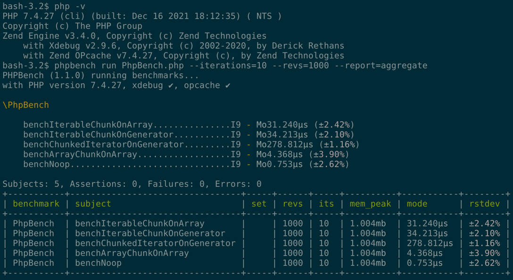

# iterable-chunk

Класс для разбиения итерируемых коллекций на пачки.

P.S. Реализован с использованием генераторов.

## Benchmark



## Пример использования

```php
$iterable = [1, 2, 3, 4, 5];

$chunks = new IterableChunk($iterable, 2, true);

foreach ($chunks as $chunk) {
    print_r($chunk);
}
```
```text
[0 => 1, 1 => 2]
[2 => 3, 3 => 4]
[4 => 5]
```

## Полезняки

```bash
composer run fix
composer run lint
composer run test

composer run phpstan
composer run phpunit
composer run phpmd
composer run phpcs
composer run php-cs-fixer
composer run phpcbf
composer run ecs
composer run ecs-fix
composer run bench
```

Если `composer run lint` не проходит после вызова `composer run fix`, попробуйте прогнать `composer run fix` раз 5-6.
В силу того, что ecs/php-cs-fixer исправляют ошибки неитеративно, то появляется необходимость в прогоне `composer run fix` несколько раз.
